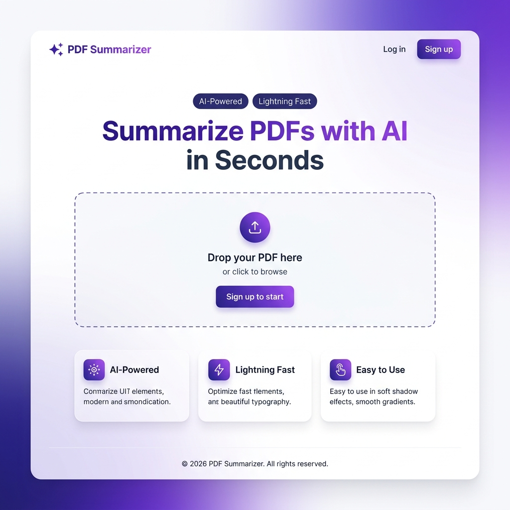
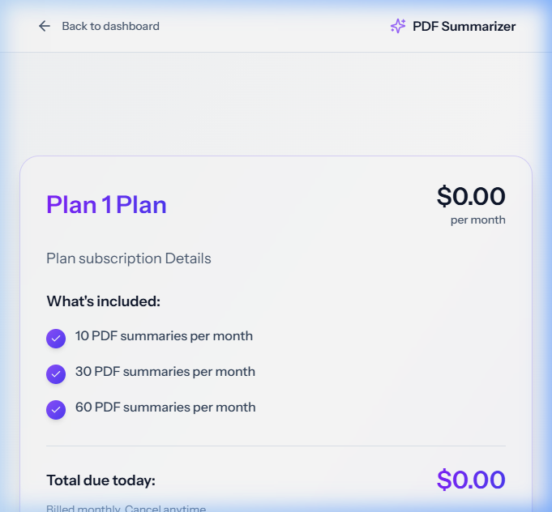
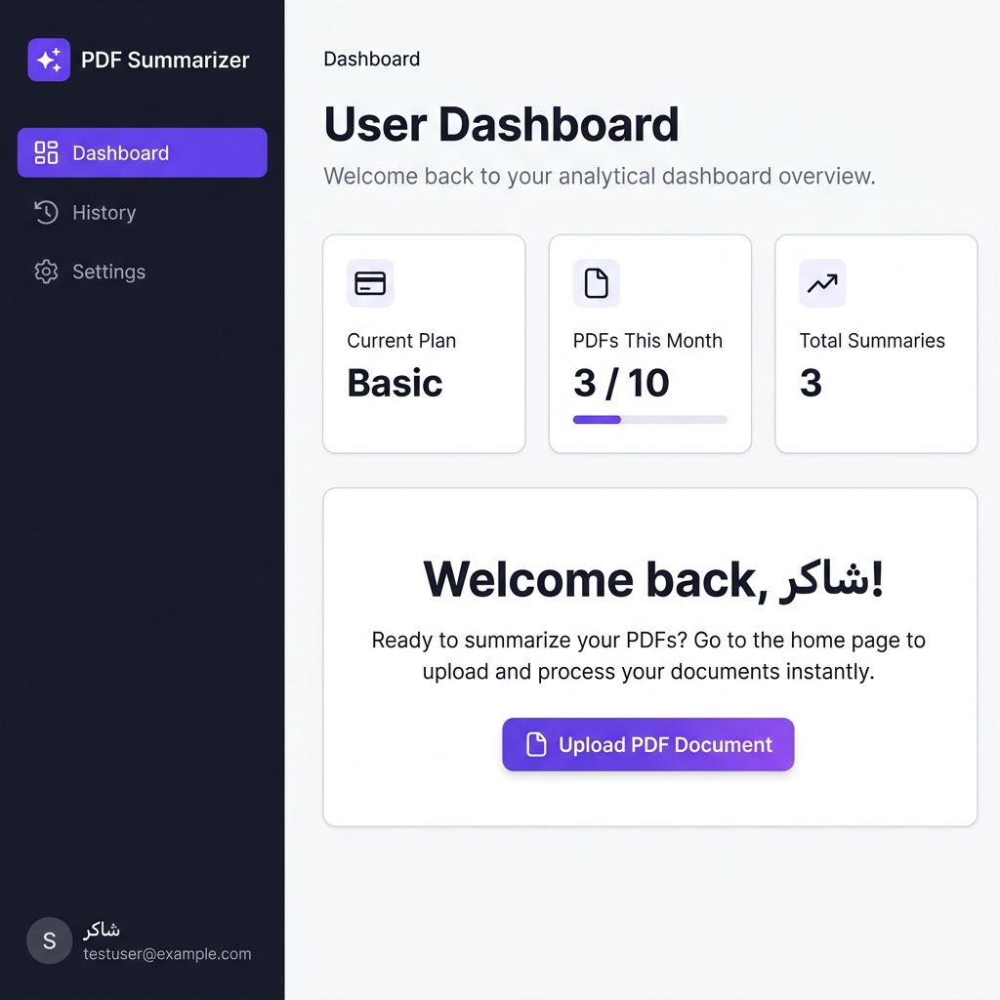
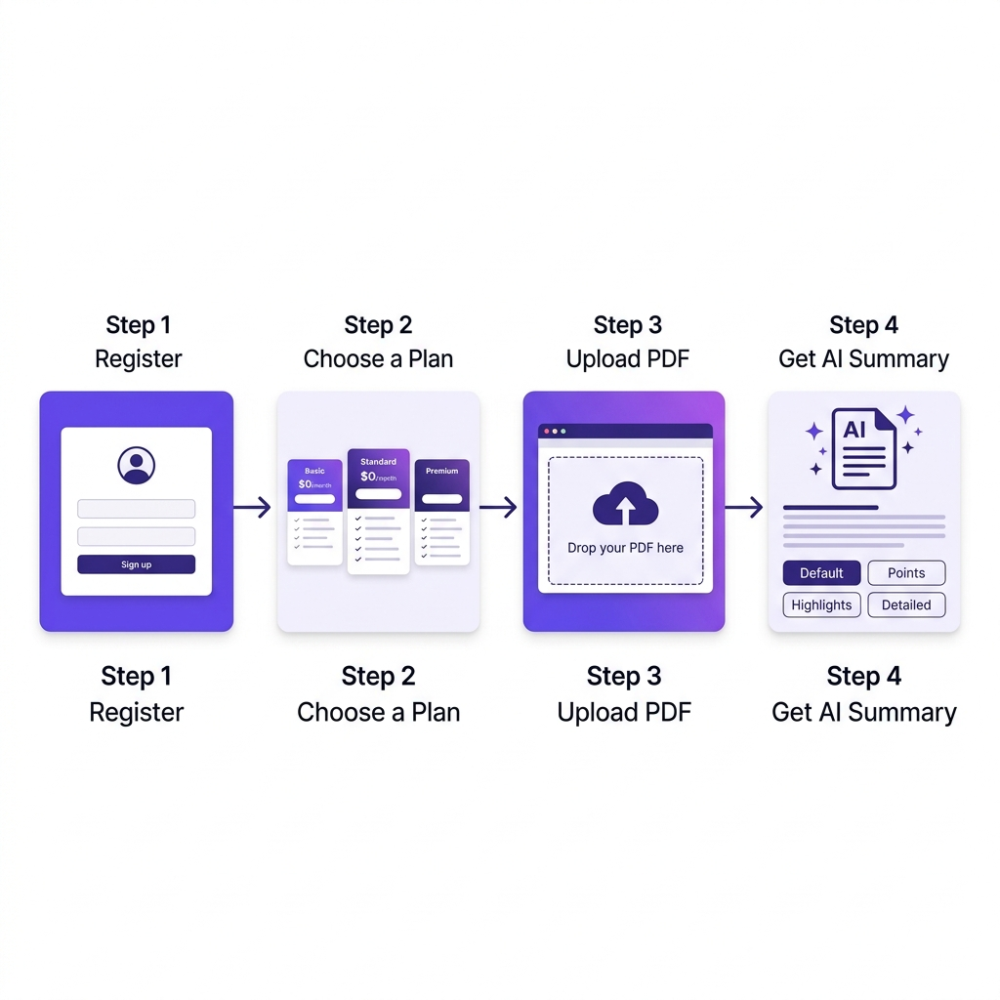

<h1 align="center">
  
</h1>

<h1 align="center">✨ PDF Summarizer – AI-Powered SaaS Platform</h1>

<p align="center">
  
  
  
  
  
  
  
</p>

<p align="center">
  منصة SaaS متكاملة لتلخيص ملفات PDF باستخدام الذكاء الاصطناعي، مبنية على معمارية <strong>Domain-Driven Design (DDD)</strong> مع دعم الاشتراكات عبر <strong>Stripe</strong>.
</p>

---

## 📸 لقطات المنصة (Screenshots)

### 🏠 الصفحة الرئيسية (Homepage)


---

### 📤 رفع ملف PDF (PDF Upload)


---

### 💳 اختيار الباقة (Pricing Plans)


---

### 📊 لوحة التحكم (User Dashboard)


---

### 🔄 طريقة العمل (Workflow Diagram)


---

## 🚀 المميزات الرئيسية

| الميزة | الوصف |
|--------|--------|
| 🤖 **AI Summarization** | تلخيص PDFs تلقائياً بأنواع متعددة: Default / Points / Highlights / Detailed |
| 💳 **Stripe Subscriptions** | نظام اشتراكات متكامل مع معالجة Webhooks |
| 👤 **Multi-role System** | نظام أدوار (Admin / User) مع لوحة تحكم مخصصة لكل دور |
| 📜 **Upload History** | سجل كامل لجميع الملفات المرفوعة مع إمكانية التصدير بصيغة TXT أو PDF |
| 🔒 **Auth via Fortify** | مصادقة متكاملة مع دعم Passkeys و 2FA |
| 🎯 **DDD Architecture** | معمارية نظيفة وقابلة للتوسع |
| ⚡ **Vite + Inertia.js** | SPA experience بدون API منفصل |

---

## 🏗️ المعمارية – Domain-Driven Design (DDD)

المشروع مبني على مبادئ **DDD** بتقسيم واضح بين طبقة المجال (Domain) وطبقة العرض (Presentation):

```
src/
├── Domain/
│   ├── Admin/          # منطق الأعمال الخاص بالمسؤول
│   └── User/           # منطق الأعمال الخاص بالمستخدم
│
└── Presentation/
    ├── Admin/
    │   ├── Controllers/   # AdminController.php
    │   ├── Routes/        # admin.php
    │   └── Views/         # واجهات لوحة الإدارة
    │
    ├── User/
    │   ├── Controllers/
    │   │   ├── PDFSummarizeController.php    # رفع وتلخيص PDF
    │   │   ├── SubscriptionController.php    # إدارة الاشتراكات
    │   │   └── StripeWebhookController.php   # معالجة أحداث Stripe
    │   ├── Routes/        # web.php
    │   └── Views/pages/
    │       ├── welcome.tsx    # الصفحة الرئيسية
    │       ├── dashboard.tsx  # لوحة التحكم
    │       ├── history.tsx    # سجل الملفات
    │       └── checkout.tsx   # صفحة الدفع
    │
    └── Shared/
        ├── components/    # مكونات مشتركة (FlashMessage, SummaryModal…)
        ├── Layouts/       # تخطيطات الصفحات
        └── lib/           # أدوات مساعدة
```

---

## 🗃️ نماذج قاعدة البيانات (Database Schema)

```
users
├── id, name, email, password
├── role (admin | user)
├── plan_id → plans
├── pdf_count, pdf_count_reset_at
└── two_factor_secret, passkeys…

plans
├── id, name, slug, des
├── price, pdf_limit
└── features (JSON)

pdf_summaries
├── id, user_id → users
├── file_name, summary
└── created_at
```

---

## 🛠️ التقنيات المستخدمة

### Backend
| التقنية | الإصدار | الغرض |
|---------|---------|--------|
| **PHP** | 8.3+ | لغة البرمجة الأساسية |
| **Laravel** | 13.x | الإطار الخلفي الرئيسي |
| **Laravel Fortify** | 1.37+ | المصادقة وإدارة الجلسات |
| **Inertia.js (Laravel)** | 3.x | الجسر بين Laravel وReact |
| **Laravel Wayfinder** | 0.1+ | توليد Routes بشكل Type-safe |
| **smalot/pdfparser** | 2.12+ | استخراج نص PDF |
| **stripe/stripe-php** | 20.x | معالجة المدفوعات |
| **SQLite** | — | قاعدة البيانات |
| **PestPHP** | 4.x | الاختبارات التلقائية |

### Frontend
| التقنية | الإصدار | الغرض |
|---------|---------|--------|
| **React** | 19.x | واجهة المستخدم |
| **TypeScript** | 5.x | Type Safety |
| **Inertia.js (React)** | 3.x | SPA بدون API |
| **Tailwind CSS** | 4.x | التصميم |
| **Radix UI** | Latest | مكونات UI قابلة للوصول |
| **Lucide React** | 0.475+ | أيقونات |
| **Vite** | 8.x | أداة البناء |
| **jsPDF + html2canvas** | Latest | تصدير الملخصات كـ PDF |

---

## 📦 التثبيت والتشغيل

### الخطوات

```bash
# 1. نسخ المستودع
git clone https://github.com/your-username/SaaS_Pdf.git
cd SaaS_Pdf

# 2. تثبيت الاعتمادات
composer install
npm install

# 3. إعداد البيئة
cp .env.example .env
php artisan key:generate

# 4. إعداد قاعدة البيانات
touch database/database.sqlite
php artisan migrate --seed

# 5. تشغيل المشروع (Laravel + Vite معاً)
composer run dev
```

---

<p align="center">
  صُنع بـ ❤️ باستخدام Laravel + React + DDD
</p>
